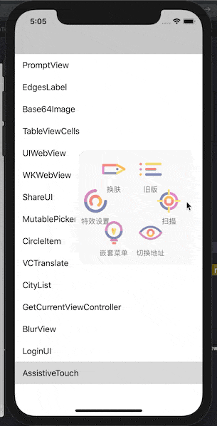

# MOONAssistiveTouch

      

### WO ZI JI YE KAN BU DONG

[简体中文版介绍](./README_CN.md)

### Who am I

A bundle of debug UI that looks like iOS system AssistiveTouch.

### Talk is CHEAP, show me the GIF



### How to SETUP

* CocoaPods:

  ```c
  source 'https://github.com/darkThanBlack/MOONAssistiveTouch.git'
  
  platform :ios, '8.0'
  
  pod 'MOONAssistiveTouch', :git => 'https://github.com/darkThanBlack/MOONAssistiveTouch.git', :tag => '0.0.4'
  ```

* Carthage:

  ```c
  github "darkThanBlack/MOONAssistiveTouch"
  ```

### How to USE

* JUST SEE SEE:

  ```objective-c
  #import "MOONAssistiveTouch/MOONATCore.h"
  
  - (BOOL)application:(UIApplication *)application didFinishLaunchingWithOptions:(NSDictionary *)launchOptions {
      [[MOONATCore core]configMenuItemActions:[MOONATCore demoActions]];
      [[MOONATCore core] start];
  }
  ```

* Sample codes:

  ```objective-c
  //adapt cocoapods and carthage
  #import "MOONAssistiveTouch/MOONATCore.h"
  
  - (BOOL)application:(UIApplication *)application didFinishLaunchingWithOptions:(NSDictionary *)launchOptions {
      [[MOONATCore core]configMenuItemActions:[self demoActions]];
      [[MOONATCore core] start];
  }
  
  - (NSArray<MOONATMenuItemAction *> *)demoActions
  {
      MOONATMenuItemAction *action_skin = [MOONATMenuItemAction actionWithTitle:@"换肤" itemBlock:^(MOONATMenuItemAction * _Nonnull action) {
          [action triggerAssistiveTouchAction:MOONAssistiveTouchActionModeChangeSkin params:nil];
          //do what you want to do
      }];
  
      MOONATMenuItemAction *action_delay = [MOONATMenuItemAction actionWithTitle:@"延时变淡" itemBlock:^(MOONATMenuItemAction * _Nonnull action) {
          [action triggerAssistiveTouchAction:MOONAssistiveTouchActionModeChangeDelayFade params:nil];
      }];
      
      MOONATMenuItemAction *action_absorb = [MOONATMenuItemAction actionWithTitle:@"吸附模式" itemBlock:^(MOONATMenuItemAction * _Nonnull action) {
          [action triggerAssistiveTouchAction:MOONAssistiveTouchActionModeChangeAbsorb params:nil];
      }];
      
      MOONATMenuItemAction *action_appearaence = [MOONATMenuItemAction actionWithTitle:@"特效设置" itemBlock:^(MOONATMenuItemAction * _Nonnull action) {
          
      }];
      
      action_appearaence.subActions = @[action_delay, action_absorb];
  	
      return @[action_skin, action_appearaence, action_sub];
  }
  ```

### Helper

* [DEMO](./MOONAssistiveTouch.xcodeproj)
* [Doxygen](./Doc/html/index.html) include **BUG LIST**

### What is THIS?

* [What is CocoaPods?](<https://github.com/CocoaPods/CocoaPods>)
* [What is Carthage?](<https://github.com/Carthage/Carthage>)
* [What is Doxygen?](<http://www.doxygen.nl/>)

### UPDATE

* **0.0.4**  add ``AboveToast``
* **0.0.3**  kill ``.plist`` in ``.bundle``
* **0.0.2**  Basic
* **0.0.1**  Create

### LICENSE

[WTFPL](<http://www.wtfpl.net/about/>) – JUST DO WHAT THE F*CK YOU WANT TO DO