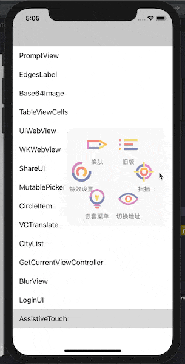

# MOONAssistiveTouch

      

### 这是什么？

一组仿照系统“便捷访问”浮窗按钮样式设计的 UI 控件，可以用于代码调试。

### 无图无真相



### 如何安装？

- CocoaPods:

  ```c
  //未上传到公有服务器，需要在 Podfile 内指定来源
  source 'https://github.com/darkThanBlack/MOONAssistiveTouch.git'
  
  platform :ios, '8.0'
  
  pod 'MOONAssistiveTouch', :git => 'https://github.com/darkThanBlack/MOONAssistiveTouch.git', :tag => '0.0.2'
  ```

- Carthage:

  ```c
  github "darkThanBlack/MOONAssistiveTouch"
  ```

### 如何使用？

- 仅展示默认DEMO效果:

  ```objective-c
  #import "MOONAssistiveTouch/MOONATCore.h"
  
  - (BOOL)application:(UIApplication *)application didFinishLaunchingWithOptions:(NSDictionary *)launchOptions {
      [[MOONATCore core]configMenuItemActions:[MOONATCore demoActions]];
      [[MOONATCore core] start];
  }
  ```

- 示例代码:

  ```objective-c
  //可以同时适应 cocoapods 和 carthage 两种方式引入
  #import "MOONAssistiveTouch/MOONATCore.h"
  
  - (BOOL)application:(UIApplication *)application didFinishLaunchingWithOptions:(NSDictionary *)launchOptions {
      [[MOONATCore core]configMenuItemActions:[self demoActions]];
      [[MOONATCore core] start];
  }
  
  ///构建菜单按钮列表
  - (NSArray<MOONATMenuItemAction *> *)demoActions
  {
      //创建菜单按钮模型
      MOONATMenuItemAction *action_skin = [MOONATMenuItemAction actionWithTitle:@"换肤" itemBlock:^(MOONATMenuItemAction * _Nonnull action) {
          [action triggerAssistiveTouchAction:MOONAssistiveTouchActionModeChangeSkin params:nil];  //触发浮窗或者菜单预先定义的一些方法
          //在 block 里面写自己需要触发的事件
      }];
  
      MOONATMenuItemAction *action_delay = [MOONATMenuItemAction actionWithTitle:@"延时变淡" itemBlock:^(MOONATMenuItemAction * _Nonnull action) {
          [action triggerAssistiveTouchAction:MOONAssistiveTouchActionModeChangeDelayFade params:nil];
      }];
      
      MOONATMenuItemAction *action_absorb = [MOONATMenuItemAction actionWithTitle:@"吸附模式" itemBlock:^(MOONATMenuItemAction * _Nonnull action) {
          [action triggerAssistiveTouchAction:MOONAssistiveTouchActionModeChangeAbsorb params:nil];
      }];
      
      MOONATMenuItemAction *action_appearaence = [MOONATMenuItemAction actionWithTitle:@"特效设置" itemBlock:^(MOONATMenuItemAction * _Nonnull action) {
          
      }];
      
      //适用于个数较多，需要子菜单的情况
      action_appearaence.subActions = @[action_delay, action_absorb];
  	
      return @[action_skin, action_appearaence, action_sub];
  }
  ```

### 文档

- [DEMO](./MOONAssistiveTouch.xcodeproj)
- [Doxygen](./Doc/html/index.html) include **BUG LIST**

### 名词解释

- [What is CocoaPods?](<https://github.com/CocoaPods/CocoaPods>)
- [What is Carthage?](<https://github.com/Carthage/Carthage>)
- [What is Doxygen?](<http://www.doxygen.nl/>)

### LICENSE

[WTFPL](<http://www.wtfpl.net/about/>) – JUST DO WHAT THE F*CK YOU WANT TO DO.